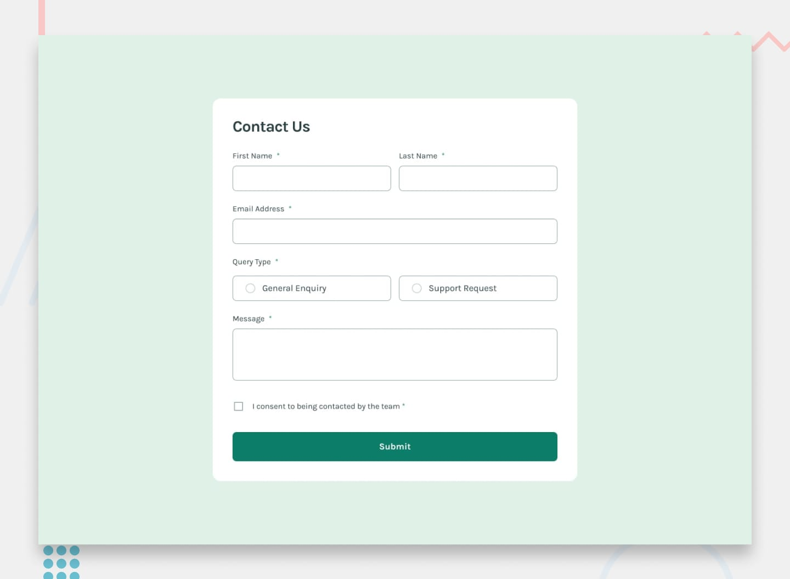

# Frontend Mentor - Contact form solution

This is a solution to the [Contact form challenge on Frontend Mentor](https://www.frontendmentor.io/challenges/contact-form--G-hYlqKJj). Frontend Mentor challenges help you improve your coding skills by building realistic projects.

## Table of contents

- [Overview](#overview)
  - [The challenge](#the-challenge)
  - [Screenshot](#screenshot)
  - [Links](#links)
- [My process](#my-process)
  - [Built with](#built-with)
- [Author](#author)
- [Reminder](#reminder)

## Overview

### The challenge

Users should be able to:

- Complete the form and see a success toast message upon successful submission
- Receive form validation messages if:
  - A required field has been missed
  - The email address is not formatted correctly
- Complete the form only using their keyboard
- Have inputs, error messages, and the success message announced on their screen reader
- View the optimal layout for the interface depending on their device's screen size
- See hover and focus states for all interactive elements on the page

### Screenshot 🔳

### Links 🔗

- Solution URL: [https://github.com/JohnMwendwa/contact-form](https://github.com/JohnMwendwa/contact-form)
- Live Site URL: [https://johnmwendwa.github.io/contact-form](https://johnmwendwa.github.io/contact-form/)

## My process 🛠

### Built with

- Semantic HTML5 markup
- CSS custom properties
- CSS flexbox
- CSS Grid
- Mobile-first workflow
- JavaScript

## Author 🤵

- Website - [John Mwendwa](https://johnmwendwa.vercel.app/)
- Frontend Mentor - [@JohnMwendwa](https://www.frontendmentor.io/profile/JohnMwendwa)

## Reminder 📝

Mastering software development is a journey, not a destination. Embrace challenges as opportunities to grow and innovate.
